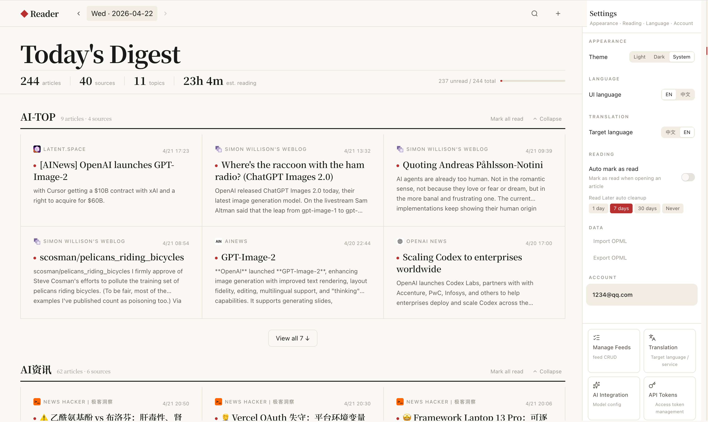

# Glean

**[English](./README.md)** | **[中文](./README.zh-CN.md)**

> [!IMPORTANT]
> This README describes the current `feature/milvus-to-pgvector` branch, not `main`.
> For a branch-to-main delta summary, see [docs/README.main-vs-feature.md](./docs/README.main-vs-feature.md).

> [!NOTE]
> Join our [Discord](https://discord.gg/KMKC4sRVSJ) to follow updates and get support.
> This project is still under active development.

Glean is a self-hosted RSS reader and personal knowledge management tool for high-volume reading workflows.



## What This Branch Includes

- RSS/Atom subscriptions with nested folders, OPML import/export, and per-feed refresh state.
- RSSHub support with admin-configured conversion, auto-fallback, and manual RSSHub-path subscription.
- Discover workflow for finding new sources and converting candidates into subscriptions.
- Immersive bilingual reading with persisted translation cache and multiple translation providers.
- Bookmarks, tags, read-later, folder organization, and responsive desktop/mobile reader flows.
- Admin dashboard with feed operations, retry/reset actions, batch management, and user administration.
- PostgreSQL + `pgvector` vector storage. This branch no longer depends on Milvus.

## Quick Start

### Docker Compose

```bash
# Download the compose file from this branch
curl -fsSL https://raw.githubusercontent.com/GoToBoy/glean/feature/milvus-to-pgvector/docker-compose.yml -o docker-compose.yml

# Optional: download the example env file from this branch
curl -fsSL https://raw.githubusercontent.com/GoToBoy/glean/feature/milvus-to-pgvector/.env.example -o .env

# Start Glean
docker compose up -d

# Optional: enable local MTranServer for translation
docker compose --profile mtran up -d
```

Access:

- Web App: `http://localhost`
- Admin Dashboard: `http://localhost:3001`
- API Health: `http://localhost:8000/api/health`

### Default Admin Account

An admin account is created automatically by default:

- Username: `admin`
- Password: `Admin123!`

Change this password before any real deployment.

## Deployment Notes

This branch uses a single PostgreSQL instance with the `pgvector` extension for vector storage.
There is no separate Milvus service in the default stack.

Default services:

- `postgres` - PostgreSQL 16 with `pgvector`
- `redis` - task queue / cache
- `backend` - FastAPI API server
- `worker` - background jobs for feed fetch, cleanup, translation, embeddings
- `web` - main reader UI
- `admin` - admin dashboard
- `mtranserver` - optional translation service, enabled via `--profile mtran`

Prebuilt images are available on GHCR:

- `ghcr.io/leslieleung/glean-backend:latest`
- `ghcr.io/leslieleung/glean-web:latest`
- `ghcr.io/leslieleung/glean-admin:latest`

Supported architectures: `linux/amd64`, `linux/arm64`

## Configuration

Important environment variables:

| Variable | Description | Default |
| --- | --- | --- |
| `SECRET_KEY` | JWT signing key | `change-me-in-production-use-a-long-random-string` |
| `POSTGRES_PASSWORD` | PostgreSQL password | `glean` |
| `ADMIN_USERNAME` | Default admin username | `admin` |
| `ADMIN_PASSWORD` | Default admin password | `Admin123!` |
| `CREATE_ADMIN` | Auto-create admin at startup | `true` |
| `WEB_PORT` | Web UI port | `80` |
| `ADMIN_PORT` | Admin UI port | `3001` |
| `IMAGE_TAG` | Docker image tag | `latest` |
| `MTRAN_SERVER_URL` | Backend/worker translation endpoint | `http://mtranserver:5001` |
| `WORKER_JOB_TIMEOUT_SECONDS` | Worker timeout for long-running jobs | `1800` |

For all options, see [.env.example](./.env.example).

## Current Capability Highlights

### Reader and Translation

- Auto-translate non-Chinese content into Chinese.
- Sentence/paragraph-aware bilingual rendering with persisted cache.
- Configurable translation providers, including MTranServer and remote-provider setups.
- Improved mobile reader navigation, list restore, and reduced duplicate translation work.

### Feeds and Discovery

- Add feeds by feed URL, website URL, or RSSHub path.
- RSSHub auto-fallback when a source URL is not directly subscribable.
- Discover page with candidate feedback and source exploration.
- Feed refresh tracking with attempt/success timestamps and clearer error handling.

### Admin and Operations

- Feed-level refresh controls plus refresh-all / retry-errored actions.
- Batch operations in the admin feed list.
- User management, password reset, and subscription import workflows.
- Docker-oriented deployment with branch-specific compose files and optional MTran profile.

## Tech Stack

### Backend

- Python 3.11+ / FastAPI / SQLAlchemy 2.0
- PostgreSQL + `pgvector`
- Redis + arq worker queue

### Frontend

- React 18 / TypeScript / Vite
- Tailwind CSS / Zustand / TanStack Query

## Development

See [DEVELOPMENT.md](./DEVELOPMENT.md) for the full setup.

Quick start:

```bash
git clone https://github.com/GoToBoy/glean.git
cd glean
npm install

# Start infra
make up

# Run migrations
make db-upgrade

# Start all dev services
make dev-all
```

Development endpoints:

- Web: `http://localhost:3000`
- Admin: `http://localhost:3001`
- API docs: `http://localhost:8000/api/docs`

## Branch-Specific Docs

- [docs/README.main-vs-feature.md](./docs/README.main-vs-feature.md) - summary of what this branch adds over `main`
- [docs/feature-change-log.md](./docs/feature-change-log.md) - feature-level change log
- [DEVELOPMENT.md](./DEVELOPMENT.md) - local development guide

## Contributing

Contributions are welcome. Start with [DEVELOPMENT.md](./DEVELOPMENT.md), then:

1. Fork the repository.
2. Create a branch.
3. Run tests and lint/type checks.
4. Open a pull request.

## License

Licensed under [AGPL-3.0](./LICENSE).
