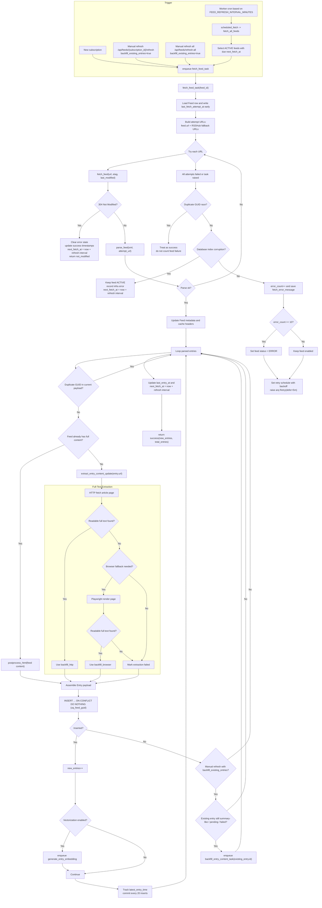

# Feed Fetch Flow

Last updated: 2026-04-10

This document describes the current feed fetching pipeline implemented in `glean`, based on the worker task, API refresh entrypoints, and RSS parsing/content extraction packages.

For failure modes and non-obvious invariants learned from recent NAS incidents, also read `docs/operations/feed-fetch-guardrails.md`.

## 1. Scope

The flow below covers:

- automatic scheduled feed sync
- manual feed refresh from API
- single-feed fetch and parse
- entry-level full-text fallback extraction
- retry and failure handling

It does not cover feed discovery during subscription creation except where that path eventually enqueues `fetch_feed_task`.

## 2. Entry Points

There are three ways a feed fetch starts:

1. New subscription enqueue:
   `POST /api/feeds/discover` creates the subscription, then enqueues one `fetch_feed_task`.
2. Manual refresh enqueue:
   `POST /api/feeds/{subscription_id}/refresh` and `POST /api/feeds/refresh-all` enqueue `fetch_feed_task` with `backfill_existing_entries=true`.
3. Scheduled refresh enqueue:
   the worker cron runs according to `FEED_REFRESH_INTERVAL_MINUTES`, finds active feeds whose `next_fetch_at` is due, and enqueues `fetch_feed_task`.

## 3. Flow Diagram

## 4. Step-by-Step Notes

### 4.1 Scheduling and queueing

- The worker registers `fetch_feed_task` plus cron jobs derived from `FEED_REFRESH_INTERVAL_MINUTES`.
- The interval must evenly divide 1440 minutes so one day can be represented as deterministic cron buckets.
- Scheduled sync does not fetch feeds inline. It first selects due feeds, then enqueues one job per feed.
- Manual refresh endpoints also enqueue jobs instead of performing feed fetch synchronously in the API process.
- At local midnight, the worker can also run a supplemental scheduled batch for active feeds that still have not succeeded since the local day started.

### 4.2 Feed-level fetch behavior

- The worker persists `last_fetch_attempt_at` before doing the remote fetch so the UI can reflect long-running syncs.
- It tries the saved `feed.url` first.
- It then appends RSSHub-converted fallback URLs, usually derived from `feed.site_url` or `feed.url`.
- Conditional request headers (`ETag`, `If-Modified-Since`) are only used for the primary feed URL.

### 4.3 Parsing and metadata updates

- XML is parsed with `feedparser`.
- A malformed feed only hard-fails when parsing errors occur and there are no entries.
- On success, the worker updates feed metadata such as title, description, language, site URL, and icon URL.
- Cache headers are only saved when the primary URL succeeded.

### 4.4 Entry content strategy

- Each parsed entry is checked for duplicate GUIDs within the same payload before any database write.
- If feed content looks complete enough, the worker stores that content after HTML post-processing.
- If content looks like a summary or teaser, the worker fetches the article URL and attempts full-text extraction.
- Extraction tries plain HTTP first, then browser rendering when the page appears blocked, challenge-protected, shell-only, or otherwise not extractable.

### 4.5 Existing entry backfill on manual refresh

- For entries already present in the database, normal fetch does not overwrite the row.
- During manual refresh with `backfill_existing_entries=true`, the worker checks whether the existing row still looks summary-only or has pending/failed backfill state.
- If so, it enqueues `backfill_entry_content_task` for that entry.

### 4.6 Success and failure handling

- `304 Not Modified` is treated as a successful fetch and clears previous feed error state.
- Duplicate GUID insert races are treated as benign idempotency cases.
- Database index corruption is treated as infrastructure failure, not feed failure.
- Other exceptions increment `error_count`, store `fetch_error_message`, schedule exponential backoff, and raise an arq retry.
- After 10 consecutive errors, the feed status becomes `ERROR`.

### 4.7 Operational guardrails

- Queue views must reconcile persisted active runs against Redis because a database row can outlive its ARQ job.
- Long `queue_wait` durations do not prove a worker is healthy; always check worker liveness separately.
- Terminal feed-fetch stage writes must remain idempotent and concurrency-safe.
- `WORKER_TIMEZONE` controls both cron scheduling and midnight supplementation.
- Named timezones such as `Asia/Shanghai` require timezone data in the worker image, currently provided by the Python `tzdata` dependency.

## 5. Source References

- Worker cron and task registration:
  `backend/apps/worker/glean_worker/main.py`
- Manual refresh API:
  `backend/apps/api/glean_api/routers/feeds.py`
- Feed fetch task:
  `backend/apps/worker/glean_worker/tasks/feed_fetcher.py`
- Feed HTTP fetch and discovery:
  `backend/packages/rss/glean_rss/discoverer.py`
- Feed parsing:
  `backend/packages/rss/glean_rss/parser.py`
- Full-text extraction:
  `backend/packages/rss/glean_rss/extractor.py`
- Entry backfill decision helpers:
  `backend/apps/worker/glean_worker/tasks/content_extraction.py`
