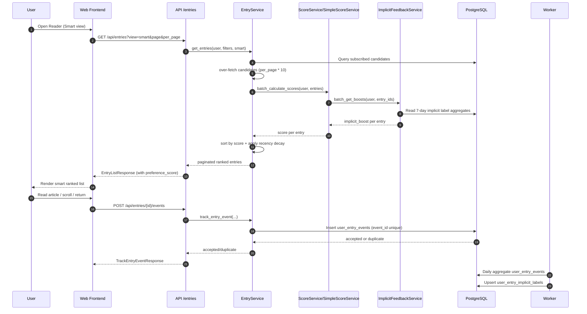

# Smart Recommendation System

Last updated: 2026-02-18

## Existing Related Docs

- `docs/technical-architecture.md`
- `docs/implicit-feedback-recommendation-plan.md`
- `docs/architecture-summary.md`

These docs cover architecture and planning. This document focuses on the current implemented behavior and end-to-end runtime flow.

## What Is Implemented Now

### 1) Request Entry

- Frontend defaults to Smart view (`/reader?view=smart`).
- Backend entry list API accepts `view=timeline|smart`.
- In `smart` mode, backend performs candidate over-fetch then rerank.

### 2) Candidate Retrieval and Rerank

- Base candidates: subscribed feeds + filters (read/like/read_later/folder/feed).
- Smart mode fetches up to `min(total, per_page * 10)` candidates.
- Backend computes score for each candidate, sorts descending, then paginates.

### 3) Scoring Path (Vector + Fallback)

- If vectorization is enabled and Milvus is healthy: use `ScoreService`.
- If unavailable: fallback to `SimpleScoreService`.

`ScoreService` score composition:

- embedding similarity (positive vs negative preference vectors)
- confidence-based interpolation toward neutral score
- source affinity boost
- author affinity boost
- implicit engagement boost

`SimpleScoreService` score composition:

- source affinity
- author affinity
- recency
- implicit engagement boost

### 4) Implicit Feedback Loop

- Frontend sends reader behavior events:
  - `entry_impression`, `entry_open`, `entry_dwell`, `entry_scroll_depth`, `entry_exit`, `entry_return`
- Event payload includes:
  - `event_id` (idempotency key), `active_ms`, `scroll_depth_max`, `est_read_time_sec`, `view`, `device_type`
- Backend writes raw events to `user_entry_events` with unique `event_id`.
- Worker runs daily aggregation (T+1) into `user_entry_implicit_labels`.
- Aggregation labels include:
  - `quick_skip_count`, `effective_read_count`, `completion_count`, `return_read_count`
- Scoring service reads recent aggregate window (7 days) and converts it into `implicit_engagement_boost` (bounded to `[-10, 10]`, controlled by config).

### 5) Runtime Controls

- `ImplicitFeedbackConfig`:
  - `enabled`, `weight`, `sample_rate`, `min_events`
  - list tracking thresholds: `list_min_visible_ratio`, `list_exposed_ms`, `list_skimmed_ms`
- `RecencyDecayConfig`:
  - applies final recency decay in smart ranking stage
- Admin endpoints can update both configs.

## End-to-End Sequence Diagram

## Notes

- List-surface tracking events are intentionally excluded in implicit label aggregation to avoid conflating list scanning with deep reading.
- Smart ranking quality depends on both explicit signals (like/dislike/bookmark) and implicit behavior aggregates.
